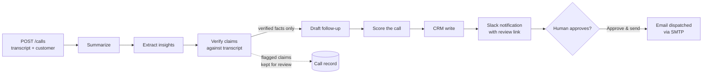

# Auralis — Post-Call Sales Intelligence

**Transcript in → verified, human-approved follow-up out.**

Auralis turns a raw sales-call transcript into a complete post-call package: a summary, structured insights, a **grounding report that verifies every claim against the transcript**, a coaching-grade scorecard for the rep, and a follow-up email that is **drafted from verified facts only** — then held for human approval before it is actually sent.

[](https://github.com/Abdullah-1121/Auralis/actions/workflows/ci.yml)
[]()
[]()
[]()

<!-- Screenshots: docs/screenshots/dashboard.png, docs/screenshots/slack.png -->

---

## Why this exists

Sales teams lose deals in the gap after the call: follow-ups go out late, CRM notes are thin, and nobody reviews how the call actually went. AI can close that gap — but off-the-shelf AI note-takers have a trust problem: **they hallucinate**, and a hallucinated "fact" in a client-facing email is worse than no email at all.

Auralis is built around that trust problem:

1. **Every extracted claim is verified.** A dedicated verifier checks each insight against the transcript and attaches the exact supporting quote. Claims it can't ground are flagged — visible to the team, **excluded from the client-facing email**.
2. **A human approves before anything is sent.** The follow-up is a draft until someone clicks *Approve & send*. Approval and dispatch outcomes are recorded on the call — `sent`, `skipped`, or `failed`, never silent.
3. **Failures are honest.** If a step fails, the call record says exactly which step and why, and every earlier step's results are preserved.

## What a processed call produces

| Output | What it is |
|---|---|
| **Summary** | Concise, business-focused recap of the call |
| **Insights** | Pain points, objections, intents, risks, integrations, sales stage, next steps |
| **Grounding report** | Per-claim verification with transcript quotes; overall confidence high/medium/low |
| **Call scorecard** | Discovery / objection handling / next-step clarity (1–5), overall /10, missed questions, deal risks, coaching tips |
| **Follow-up email** | Drafted from *verified* insights only; sent via SMTP after human approval |
| **Slack notification** | Score, confidence, and a deep link to the review page, posted when processing finishes |
| **CRM record** | Written through a provider adapter (Google Sheets today, HubSpot stub) |

## How it works



The pipeline is **deterministic plain code** — there is no "supervisor agent" deciding what to do next. LLM calls happen only where judgment is needed (summarizing, analyzing, verifying, scoring, writing). Sequencing, retries, persistence, and error handling are ordinary Python, because ordinary Python does those things reliably.

### Design decisions worth defending

- **No orchestration agent.** The v0 prototype used an LLM supervisor told to "never skip steps." v1 deleted it: a fixed sequence is code's job, not a model's. Same for the CRM "agent" — writing structured data to a CRM is deterministic work, so it's an adapter class.
- **Unverified claims never reach the customer.** The drafter receives a filtered copy of the insights containing only claims the verifier grounded. The full record keeps everything, flagged, for human review.
- **Rate-limit-aware retries.** Providers tell you how long to wait (`retry in 32s`); retrying sooner just burns attempts inside the same window. Auralis parses and honors the provider's requested delay.
- **A CRM failure doesn't fail the call.** The analysis succeeded and is valuable — it's surfaced with `crm_status=failed` stated loudly next to it.
- **Every step's result is persisted the moment it exists.** A failure at step 5 loses nothing from steps 1–4.
- **Provider-agnostic LLM config.** Any OpenAI-compatible endpoint works — Gemini, OpenRouter, Groq, a local model. Swapping providers is a `.env` change, not a code change.

## The dashboard

`GET /ui` serves a dependency-free, single-file dashboard (no build step, no frameworks):

- Submit a transcript and watch the six pipeline steps complete **live** (Server-Sent Events)
- KPI cards: call score, claims verified, confidence, delivery status
- The full grounding report with per-claim evidence quotes
- The scorecard with a radial gauge and coaching notes
- The email draft with the **Approve & send** action
- Sidebar with every processed call — including honest failures

Slack messages deep-link straight to the review page for the call.

## Quickstart

Requires Python 3.13+ and [uv](https://docs.astral.sh/uv/).

```bash
git clone https://github.com/Abdullah-1121/Auralis.git
cd Auralis
uv sync

cp .env.example .env        # then set LLM_API_KEY (see below)

uv run uvicorn auralis.api.app:app --port 8010 --app-dir src
# open http://127.0.0.1:8010/ui
```

Submit a call via the UI, or the API directly:

```bash
curl -X POST http://127.0.0.1:8010/calls \
  -H "Content-Type: application/json" \
  -d '{
        "transcript": "Rep: Hi Jordan, thanks for making time today...",
        "customer": {"name": "Jordan Malik", "company": "BrightPath", "role": "Head of Sales", "email": "jordan@brightpath.io"}
      }'
# → {"call_id": "9d0399dcc2b1", "status": "queued"}   (HTTP 202)
```

## Configuration

Everything is environment variables (or `.env`). Only the LLM key is required.

| Variable | Required | Default | Purpose |
|---|---|---|---|
| `LLM_API_KEY` | **yes** | — | API key for any OpenAI-compatible provider |
| `LLM_BASE_URL` | no | OpenRouter | Provider endpoint (Gemini, Groq, local…) |
| `LLM_MODEL` | no | `meta-llama/llama-3.3-70b-instruct:free` | Model name at that provider |
| `SLACK_WEBHOOK_URL` | no | empty | Incoming webhook; empty = notifications skipped |
| `PUBLIC_BASE_URL` | no | `http://127.0.0.1:8010` | Used for links in Slack messages |
| `SMTP_USERNAME` / `SMTP_PASSWORD` | no | empty | Enables real email dispatch on approval |
| `SMTP_HOST` / `SMTP_PORT` | no | Gmail / 587 | SMTP server |
| `CRM_PROVIDER` | no | `none` | `none` \| `sheets` \| `hubspot` |
| `DATABASE_PATH` | no | `auralis.db` | SQLite file location |

Optional integrations degrade gracefully and **state** what they did: no Slack webhook → skipped silently; no SMTP → approval recorded, `email_status=skipped`.

## API

| Endpoint | Purpose |
|---|---|
| `POST /calls` | Submit transcript + customer → `202` + `call_id` |
| `GET /calls/{id}` | Full call record (summary, insights, grounding, scorecard, draft, statuses) |
| `GET /calls/{id}/events` | Server-Sent Events stream of live pipeline progress |
| `GET /calls` | Recent calls |
| `POST /calls/{id}/approve-followup` | Human approval → dispatches the email; outcome stated |
| `GET /ui` | The dashboard |
| `GET /health` | Health check |

## Tests

```bash
uv run pytest
```

12 tests, no API key or network needed — the LLM steps are plain async functions, so the pipeline's real behavior (sequencing, persistence, retries, failure honesty, the *verified-claims-only* guarantee, dispatch outcomes) is tested by monkeypatching them. The test to read first: `test_unsupported_claims_never_reach_the_email`.

## Deployment

A container is included:

```bash
docker build -t auralis .
docker run -p 8000:8000 --env-file .env auralis
```

The live demo runs on **Hugging Face Spaces** (Docker Space, free tier — the YAML block at the top of this README is its config). It works the same on Railway, Render, or Fly.io. Wherever you deploy:

- set the environment variables from the table above as secrets,
- set `PUBLIC_BASE_URL` to the deployed URL so Slack links resolve,
- **set `BASIC_AUTH=user:password`** — the approve endpoint sends real email; a public instance must not be open.

## Roadmap

- **Account memory** — connect calls to the same account over time: *"sentiment has improved since June 12; the budget objection from call #2 was resolved in call #4."*
- **Call-source webhooks** — ingest transcripts automatically from Fireflies / Zoom instead of manual submission.
- **HubSpot adapter** — the adapter interface exists; the implementation is the roadmap item.
- **Postgres store** — the storage layer is one module; swapping SQLite out is deliberate, not painful.

## Stack

FastAPI · Pydantic v2 · openai-agents SDK · SQLite · uv · pytest — and a deliberate absence of an orchestration framework where plain code does the job better.

## License

MIT
